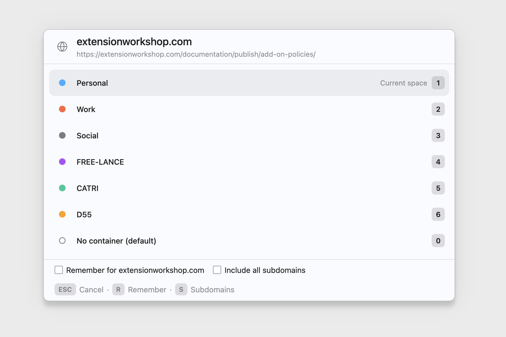
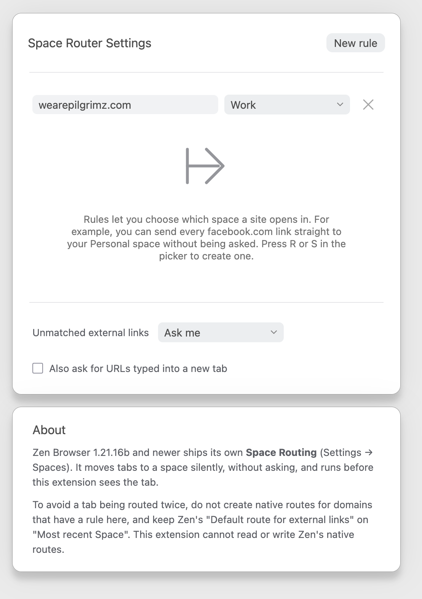

# Zen Space Router

> **Built with AI.** This extension was written by [tx2z](https://github.com/tx2z)
> with substantial help from Claude (Anthropic). The code was reviewed and
> tested by a human in a real Zen Browser, but if you are not comfortable
> using AI-assisted software, please do not use it.

When something outside the browser (a terminal, Slack, Teams, an email
client...) opens a link, Zen Space Router shows a small picker so you can
choose which Zen workspace it should open in. Tick "remember" once, and
next time a link to that site goes straight to that workspace, no picker
needed.

The picker shown for an external link with no matching rule yet.

The options page, listing saved domain rules.

> **Important: it works through containers.** Zen has no way for extensions
> to talk to spaces directly, so this extension uses Firefox containers as
> a bridge. Each space must have a container assigned, and Zen must be set
> to switch to that space when a tab using its container opens. Without
> that setting, picking a space in the picker will only change the tab's
> container, not the visible space.

## Set it up in 5 minutes

1. **Requirements**: Zen built on Firefox 142 or newer. Check
   `about:support` → "Application Basics" → "Build ID"/"Firefox" version if
   unsure; older builds refuse to install this extension.
2. **Install**: download `zen-space-router-<version>.xpi` from the
   [Releases page](https://github.com/tx2z/zen-space-router/releases), then
   drag it onto a Zen window (or open `about:addons` → the gear menu →
   "Install Add-on From File" and select it). Updates are automatic from
   then on (the extension checks this repository's `updates.json`).
3. In Zen, give each space a container: open that space's settings and
   assign it one.
4. In Zen settings, enable "Switch to workspace where container is set as
   default when opening container tabs".
5. Set Zen as your default browser, so external links land in it.
6. Try it: run `open https://example.com` in a terminal, or click a link
   in another app.

## How to use it

| Key | Action |
|---|---|
| `1`-`9` | Open in that container |
| `0` | Open with no container |
| `r` | Toggle "remember this domain" |
| `s` | Toggle "include all subdomains" |
| `Esc` | Cancel, close the tab |

A remembered rule for a domain also matches its subdomains. The options
page (open it from `about:addons`) lists, edits and removes saved rules,
and has toggles for how unmatched links and typed URLs are handled.

Zen also ships its own native Space Routing. Don't create a native route
for a domain already routed here, to avoid double routing, and leave Zen's
"Default route for external links" on "Most recent Space" so it doesn't
compete with this extension.

## Privacy

Zen Space Router collects no data and makes no network requests. Rules and
settings live entirely in `browser.storage.local`, on your machine. See the
[permissions table](docs/TECHNICAL.md#permissions-table) for what each
requested permission is used for.

## Want to know more?

[docs/TECHNICAL.md](docs/TECHNICAL.md) covers how the extension detects
and intercepts external links, its known limitations, what hasn't been
verified yet, and how to develop, test, and release it. See
[CONTRIBUTING.md](CONTRIBUTING.md) for how to run the checks and test
changes in Zen.

## Contributing and credits

Made by [tx2z](https://github.com/tx2z) with the help of Claude, for the
Zen Browser community. Bug reports, feature requests and pull requests are
welcome: open an issue or a PR on GitHub.

## License

MIT, see [LICENSE](LICENSE).
